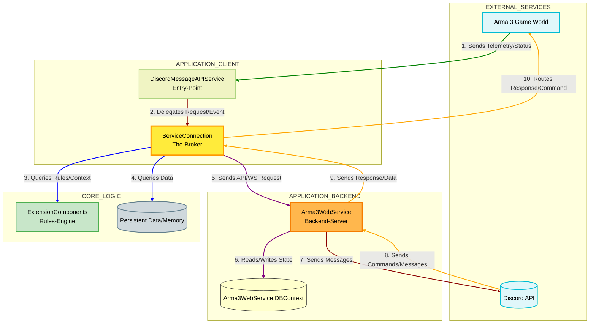

# 🤓 Dev document

### Arma3WebService

The `Arma3WebService` is the backend service of the Discord Message API, acting as the central hub for Discord Bot integration, database management, and the WebSocket server.

* **Purpose**: It handles the core logic for interacting with Discord, managing server data, and providing administrative interfaces. It's responsible for integrating with the Discord Bot, managing the database, and running the WebSocket server for real-time communication.
* **Language**: C#.
* **Platform**: ASP.NET Core.
* **Key Functionalities**:
  * **Discord Bot Integration**: Manages the Discord bot's connection and interactions with Discord, including sending messages, handling commands, and managing permissions.
  * **Database Management**: Handles data persistence for configurations and other relevant information.
  * **WebSocket Server**: Facilitates real-time, bidirectional communication with the Arma 3 game server, allowing for instant updates and command execution.
  * **Configuration**: Configured primarily through environment variables or an `.env` file, with `appsettings.json` providing default values. This includes Discord bot token, database connection strings, service ports (WebSocket and Admin Console), and logging levels.

***

### Breakdown `DiscordMessageAPIService.dll`

The `DiscordMessageAPIService.dll` component acts as a crucial bridge between the Arma 3 game server and the `Arma3WebService` backend.

Its core methods are in `extension/ServiceConnection`.&#x20;

* **Purpose**: It's a DLL (Dynamic Link Library) that facilitates communication between the Arma 3 game engine (which uses SQF scripts) and the C# backend service. It handles data serialization and local service operations.
* **Language**: C#.
* **Platform**: _Windows **DLL**_ / _Linux **SO**_.
* **Key Functionalities**:
  * **Arma 3 ↔ Backend Bridge**: Enables Arma 3 to send data to and receive data from `Arma3WebService`.
  * **Data Serialization**: Responsible for converting data between Arma 3's SQF format and the format expected by the C# backend.

## :bar\_chart: Overview:

