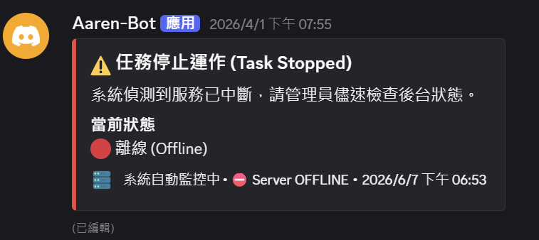

# 📤 Server-Side Extension


`DiscordMessageAPISerivce.dll` is a **server-side** extension.

* Make sure the mod is load via `-servermod` instead of `-mod` to **bypass BattEye whitelist** or it may not work as intented.


## 🖼️ Message template

The format still follows the same as [Webhook's](../customize-server-info.md).

<div><figure><figcaption><p>Online Example</p></figcaption></figure> <figure><figcaption><p>Offline Example</p></figcaption></figure></div>


Don't use `ComponentsV2` for server monitor template.

* It will make the message not editable.
* Some fields will not be accepted, ex. `Embeds`.

Offical Docs : [https://docs.discord.com/developers/components/reference](https://docs.discord.com/developers/components/reference)


<details>

<summary>📫Monitor Template</summary>

````json
{
  "embeds": [
    {
      "title": "🛰️ {SERVER_NAME} | Status Details",
      "description": "### Mission: `{MISSION_NAME}`\n**Status:** :white_check_mark: Server Online",
      "color": "3447003",
      "fields": [
        {
          "name": "📍 General Info",
          "value": "> **Map:** {MAP_NAME}\n> **Version:** {GAME_VERSION}\n> **Players:** {PLAYER_COUNT} / {AVALIABLE_PLAYERS}",
          "inline": true
        },
        {
          "name": "📊 Performance",
          "value": "**Server FPS:** `{SERVER_FPS}` (Min: {FPS_MIN})\n**Active Scripts:** `{ACTIVE_SCRIPTS}`",
          "inline": true
        },
        {
          "name": "🌐 Connection Details",
          "value": "```fix\narma.server.address:2302\n```",
          "inline": false
        },
        {
          "name": "👥 Player List",
          "value": "```\n{PLAYER_LIST}\n```",
          "inline": true
        },
        {
          "name": "⚡ Network Stats",
          "value": "```\n{PLAYER_NETWORK}\n```",
          "inline": true
        },
        {
          "name": "🛠️ Player Status",
          "value": "```\n{PLAYER_STATE}\n```",
          "inline": true
        }
      ],
      "footer": {
        "text": "Last updated: {SYSTEM_DATE} {SYSTEM_TIME}",
        "icon_url": "https://i.imgur.com/410CmKi.png"
      }
    }
  ],
  "components": [
    {
      "type": 1,
      "components": [
        {
          "type": 2,
          "style": 5,
          "label": "JOIN NOW",
          "url": "https://arma.abc.com"
        }
      ]
    }
  ]
}

````


</details>

<details>

<summary>⭕Offline Template</summary>

```json
{
  "embeds": [
    {
      "title": "⚠️ Mission Stopped",
      "description": "The system has detected that the service has been interrupted. Administrators, please check the backend status as soon as possible.",
      "color": "15548997",
      "fields": [
        {
          "name": "Current Status",
          "value": "🔴 Offline",
          "inline": true
        }
      ],
      "footer": {
        "text": "System under automatic monitoring • ⛔ Server OFFLINE",
        "icon_url": "https://i.imgur.com/410CmKi.png"
      },
      "timestamp": "true"
    }
  ]
}

```


</details>

***

## ✏️ Setting up

* First, navigate to the directory of `arma3server_x64.exe`/`arma3_x64.exe`.\
  There should be `Discord_Message_API` folder (if no, create a new one), that's where the configs are.
* `./logs` where the logs live if you want to debug.

<div data-with-frame="true"><figure><figcaption><p>Setup Example <strong>(Reds are IMPROTANT)</strong></p></figcaption></figure></div>

## 🎮 Configure `secret.json`


```json
{
  "ServiceUri" : "http://localhost:5048", //- `https://` for SSL/TLS
  "WebSocketServiceUri" : "ws://localhost:5048/api/ws/ingame", //-  `wss://` for SSL/TLS
  "RPT_Directory": "C:/Users/MyUser/AppData/Local/Arma 3", //- Default RPT Directory
  "Secret" : { //- API Endpoint Auth
    "ApiKey" : "MY SERVICE API KEY"
  }
}
```


### 👥 Configure Profile (Optional)

This must be in `./profiles` folder that can be changed in `Addons Settings`.


```json
{
  //- "Configuration" can be emply, but "CANNOT BE REMOVED" e.g. "Configuration": {}
  "Configuration": {
    //- (OPTIONAL) Directory to the online template file
    "MessageTemplate": "MyTemplates/Server_Info_msg.json",
    //- (OPTIONAL) Dirctory to your offline template
    "MessageOfflineTemplate": "Offline_msg.json"
  },
  //- (OPTIONAL) will fallback to `secret.json`
  "RPT_Directory": "C:/Users/MyUser/AppData/Local/Arma 3"
}
```

